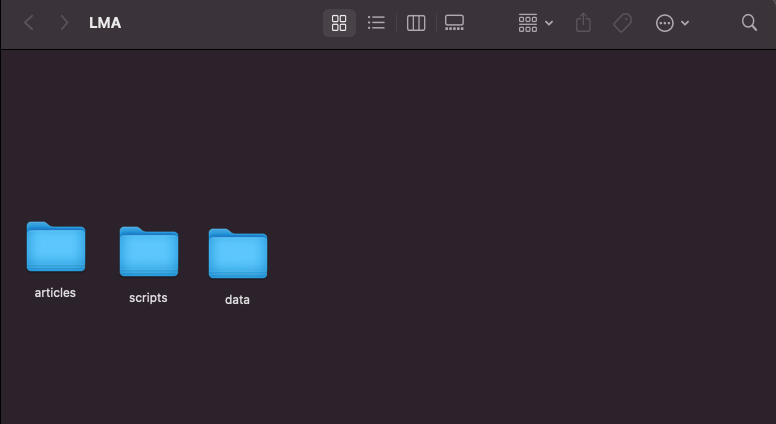
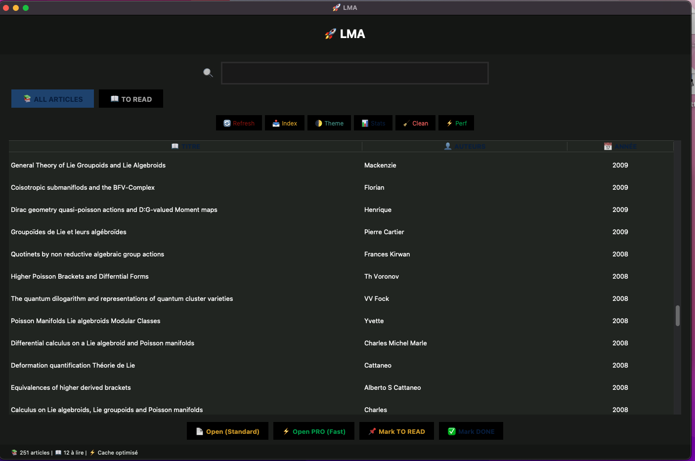
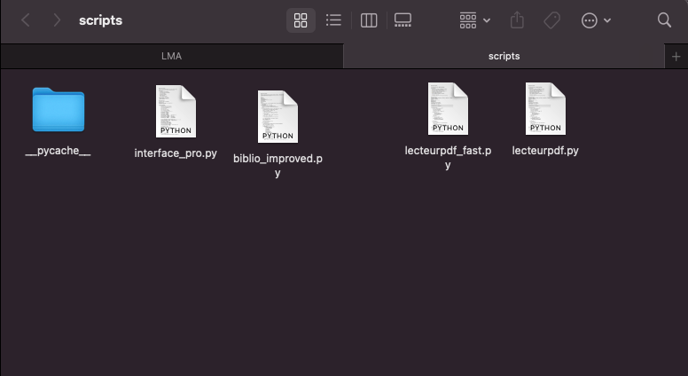
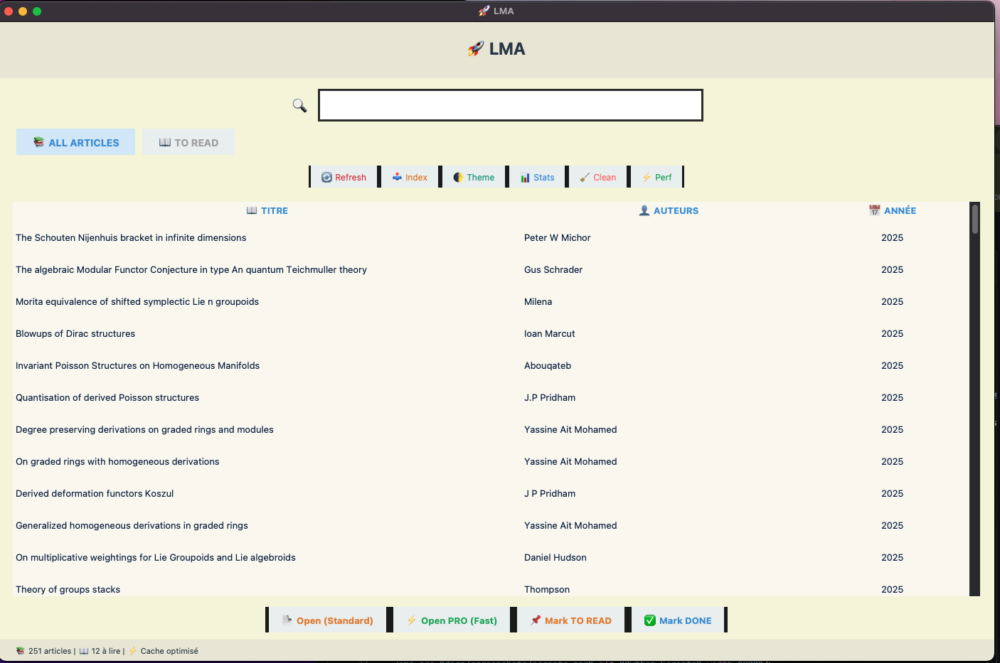

# 🚀 LMA - Literature Management Assistant

**Professional PDF Library Manager for Academic Research**

[](https://www.python.org/)
[](LICENSE)
[]()
[](https://github.com/yassineaitmohamed/LMA/stargazers)

LMA is a powerful desktop application designed for researchers, PhD students, and academics to efficiently manage, search, and read their PDF library. Built with performance and usability in mind, it features an intelligent caching system, ultra-fast PDF reader, and comprehensive annotation capabilities.

---

## 📸 Screenshots

### 🗂️ LMA Folder on Desktop


*LMA folder on your Desktop - organized workspace for research*

### 📁 Project Structure


*Three main folders: **articles** (your PDFs), **scripts** (Python files), **data** (database)*

### 📚 Main Interface - Dark Theme


*Professional dark theme with article list, search bar, and smart filters. Shows 251 articles indexed.*

### 🌟 Main Interface - Light Theme  


*Clean light theme optimized for daytime reading - same powerful features*

### 🐍 Python Scripts


*Core application files: interface_pro.py, biblio_improved.py, lecteurpdf_fast.py, lecteurpdf.py*

---

## ✨ Key Features

### 📚 Smart Library Management
- **Automatic Indexing**: Scan and index PDF files with metadata extraction
- **Intelligent Search**: Full-text fuzzy search across titles, authors, keywords, and content
- **Reading Status**: Track articles with "To Read" and "Already Read" tags
- **Auto-Cleanup**: Automatically removes database entries for deleted files
- **Multiple Formats**: Support for various PDF naming conventions
- **Hash-Based Detection**: Prevents duplicate entries
- **Real-Time Stats**: Shows article count and "to read" count

### 🚀 Ultra-Fast PDF Reader
- **Intelligent Caching**: LRU cache with 15 pages + preloading (±2 pages)
- **< 10ms Page Transitions**: 5x faster than standard PDF viewers
- **Advanced Annotations**: Multi-color highlighting, notes, bookmarks, favorites
- **Search with Counter**: Instant full-text search with result navigation
- **Thumbnail Navigation**: Dynamic thumbnail panel for quick page jumps
- **Dual Reading Modes**: 
  - 📖 Standard Mode - Regular reading
  - ⚡ PRO Mode - Ultra-fast with advanced cache
- **Dual Theme**: Professional dark/light modes (Oxford/UdeS colors)
- **20+ Keyboard Shortcuts**: Power user workflow optimization

### 🤖 AI Tools Integration
- **Smart Summary**: AI-powered article summarization
- **Key Points Extraction**: Extract main concepts and findings
- **Content Analysis**: Analyze document structure and topics
- **Citation Generator**: Export in multiple formats (Markdown, TXT, JSON, BibTeX)

### 🎨 Modern User Interface
- **Clean Design**: Professional, distraction-free interface
- **Oxford/UdeS Themes**: Academic color schemes
  - 🌙 Dark: Professional black with blue/green accents
  - ☀️ Light: Clean beige with crisp typography
- **Responsive Layout**: Optimized for 13"+ displays (1400x900 minimum)
- **Performance Stats**: Real-time cache hit rate (shown: "Cache optimisé")
- **Smart Filters**: ALL ARTICLES / TO READ tabs
- **Action Buttons**: Refresh, Index, Theme, Stats, Clean, Performance

---

## 📋 System Requirements

### Minimum Requirements
- **Python**: 3.8 or higher
- **RAM**: 4GB minimum, 8GB recommended
- **Disk Space**: 500MB for application + space for your PDFs
- **Display**: 1400x900 minimum resolution (optimized for MacBook Pro 13")

### Supported Operating Systems
- ✅ **macOS**: 10.14+ (Mojave and later) - Native support
- ✅ **Linux**: Ubuntu 20.04+, Debian 10+, Fedora 32+
- ✅ **Windows**: 10/11 (with minor adjustments)

### Dependencies
- **PyMuPDF** (fitz) - Fast PDF rendering
- **PyPDF2** - PDF metadata extraction
- **fuzzywuzzy** - Fuzzy string matching for search
- **python-Levenshtein** - Fast string comparison
- **Pillow** (PIL) - Image processing for thumbnails
- **tkinter** - GUI framework (usually included with Python)

---

## 🔧 Complete Installation Guide

### Step 1: Install Python

#### macOS
```bash
# Check if Python is installed
python3 --version

# If not installed, use Homebrew
brew install python3

# Or download from python.org
# https://www.python.org/downloads/
```

#### Linux (Ubuntu/Debian)
```bash
# Update package list
sudo apt update

# Install Python and tkinter
sudo apt install python3 python3-pip python3-tk

# Verify installation
python3 --version
pip3 --version
```

#### Windows
1. Download Python from [python.org](https://www.python.org/downloads/)
2. Run installer and **CHECK "Add Python to PATH"**
3. Verify in Command Prompt:
   ```cmd
   python --version
   pip --version
   ```

---

### Step 2: Clone or Download LMA

#### Option A: Clone with Git (Recommended)

```bash
# Install git if needed
# macOS: brew install git
# Linux: sudo apt install git
# Windows: download from git-scm.com

# Clone the repository
cd ~/Desktop
git clone https://github.com/yassineaitmohamed/LMA.git
cd LMA
```

#### Option B: Download ZIP

1. Go to https://github.com/yassineaitmohamed/LMA
2. Click **Code** → **Download ZIP**
3. Extract to Desktop → `LMA` folder

---

### Step 3: Install Python Dependencies

```bash
# Navigate to LMA directory
cd ~/Desktop/LMA

# Install all dependencies at once
pip3 install -r requirements.txt
```

**If requirements.txt is not present, install manually:**
```bash
pip3 install PyMuPDF PyPDF2 fuzzywuzzy python-Levenshtein Pillow
```

**For Windows users:**
```cmd
cd %USERPROFILE%\Desktop\LMA
pip install -r requirements.txt
```

**If you get permission errors:**
```bash
# Install for current user only
pip3 install --user -r requirements.txt
```

---

### Step 4: Create Directory Structure

LMA needs this folder structure on your Desktop:

```
~/Desktop/LMA/
├── articles/          # Place your PDF files here
├── data/              # Database (auto-created)
├── scripts/           # Python application files (optional)
│   ├── interface_pro.py
│   ├── biblio_improved.py
│   ├── lecteurpdf_fast.py
│   └── lecteurpdf.py
├── image1.png         # Screenshots
├── image2.png
├── image4.png
├── image5.png
└── image6.png
```

**Create the directories:**

#### macOS / Linux
```bash
cd ~/Desktop/LMA
mkdir -p articles data scripts

# Option 1: Keep Python files in root (simpler)
# Files can stay in the main LMA folder

# Option 2: Organize in scripts folder
mv *.py scripts/ 2>/dev/null || true
# or copy: cp *.py scripts/
```

#### Windows
```cmd
cd %USERPROFILE%\Desktop\LMA
mkdir articles
mkdir data
mkdir scripts

rem Move or copy Python files
move *.py scripts\
```

---

### Step 5: Add Your PDF Files

Copy your research papers to the articles folder:

```bash
# Copy individual PDFs
cp ~/Documents/research_paper.pdf ~/Desktop/LMA/articles/

# Copy entire folder
cp -r ~/Documents/Research/*.pdf ~/Desktop/LMA/articles/

# Or simply drag and drop PDFs into the articles folder
```

**Tip**: You can organize PDFs in subfolders:
```
articles/
├── Mathematics/
│   └── Lie_Algebras/
├── Physics/
└── Computer_Science/
```

LMA will scan all subfolders automatically!

---

### Step 6: Launch LMA

#### If Python files are in root folder (default):
```bash
cd ~/Desktop/LMA
python3 interface_pro.py
```

#### If Python files are in scripts folder:
```bash
cd ~/Desktop/LMA/scripts
python3 interface_pro.py
```

#### Windows:
```cmd
cd %USERPROFILE%\Desktop\LMA
python interface_pro.py
```

**First launch will:**
1. Create the database (`data/articles.db`)
2. Open the main LMA window (as shown in screenshots)
3. Show an empty library → click 🔄 **Refresh** to scan PDFs

---

### Step 7: Index Your PDF Library

1. Click the **🔄 Refresh** button in the toolbar
2. LMA will scan all PDFs in the `articles/` folder
3. Wait for indexing to complete (progress shown in status bar)
4. Your articles will appear in the list with title, author, and year!

**What gets indexed:**
- Filename and full path
- Title, authors, year (extracted from filename)
- Keywords and content (extracted from PDF metadata)
- File hash (for duplicate detection)

---

## 🚀 Quick Start Guide

### First Time Setup (5 Minutes)

1. **Launch LMA**
   ```bash
   cd ~/Desktop/LMA
   python3 interface_pro.py
   ```

2. **Index Your PDFs**
   - Click **🔄 Refresh** button (or **📥 Index**)
   - Wait for scan to complete
   - Status bar shows progress: "251 articles | 12 à lire"

3. **Search for Articles**
   Type in the search bar to find articles by:
   - **Author name**: `Mackenzie`, `Florian`, `Voronov`
   - **Year**: `2008`, `2009`, `2025`
   - **Keywords**: `Lie groupoids`, `Poisson`, `quantum`
   - **Title**: `Dirac`, `algebraic`, `manifolds`
   
   Fuzzy search works with typos!

4. **Open a PDF**
   - Double-click any article
   - **Choose reading mode:**
     - 📖 **Open (Standard)** - Regular reader
     - ⚡ **Open PRO (Fast)** - Ultra-fast with cache

5. **Mark as "To Read"**
   - Select an article
   - Click **📕 Mark TO READ** button
   - Filter by clicking **📕 TO READ** tab

6. **Toggle Theme**
   - Click **🎨 Theme** button
   - Switch between dark and light modes
   - Theme preference is saved

---

## 📖 Usage Guide

### Library Management Features

#### Toolbar Buttons (from screenshots)

| Button | Name | Function |
|--------|------|----------|
| 🔄 | **Refresh** | Re-scan articles folder for new/deleted files |
| 📥 | **Index** | Full re-indexing of all PDFs (extracts metadata) |
| 🎨 | **Theme** | Toggle dark/light theme |
| 📊 | **Stats** | Show library statistics and performance |
| 🧹 | **Clean** | Remove database entries for deleted files |
| ⚡ | **Perf** | Performance optimization and cache stats |

#### Search & Filter

**Search Bar Features:**
- **Real-time search**: Results update as you type
- **Fuzzy matching**: Typos and partial words work
- **Multi-field search**: Searches title, author, keywords, content
- **Case-insensitive**: `Poisson` = `poisson` = `POISSON`

**Filter Tabs:**
- **📚 ALL ARTICLES**: Show entire library (251 articles shown)
- **📕 TO READ**: Show only unread articles (12 à lire shown)

**Results Display:**
- **📖 TITRE**: Article title
- **👤 AUTEURS**: Author names
- **📅 ANNÉE**: Publication year

#### Action Buttons (Bottom)

| Button | Mode | Function |
|--------|------|----------|
| 📖 Open (Standard) | Regular | Standard PDF reader |
| ⚡ Open PRO (Fast) | Fast | Ultra-fast reader with cache |
| 📕 Mark TO READ | -- | Flag as unread |
| ✅ Mark DONE | -- | Mark as completed |

**Status Bar (Bottom Left):**
- 🗂️ Total articles count
- 📕 "To read" count
- ⚡ Cache status ("Cache optimisé")

---

### PDF Reading

#### Navigation
- **Arrow Keys**: `←` `→` Previous/Next page
- **Page Up/Down**: Jump multiple pages
- **Home/End**: First/Last page
- **Mouse**: Click page thumbnails
- **Go to Page**: Type page number

#### View Controls
- **Zoom**: `Ctrl/Cmd +` `-` `0`
- **Fullscreen**: `F11`
- **Thumbnails**: `Ctrl/Cmd M`
- **Fit to Window**: Auto-sizing

#### Annotations
- **Highlight**: Select text → Choose color
- **Notes**: `Ctrl/Cmd N` → Add note
- **Bookmarks**: `Ctrl/Cmd B` → Mark page
- **Export**: `Ctrl/Cmd E` → Save annotations

#### Search in PDF
- **Find**: `Ctrl/Cmd F`
- **Next Result**: `F3` or `Enter`
- **Previous**: `Shift F3`
- **Close Search**: `Esc`

#### AI Tools
- **Summarize**: Generate article summary
- **Extract Key Points**: Get main findings
- **Analyze**: Content structure analysis
- **Export Citations**: BibTeX, JSON, Markdown

---

## ⌨️ Complete Keyboard Shortcuts

### Main Window
| Shortcut | Action |
|----------|--------|
| `Ctrl/Cmd F` | Focus search box |
| `Ctrl/Cmd R` | Refresh library |
| `Ctrl/Cmd I` | Re-index all articles |
| `Ctrl/Cmd T` | Toggle dark/light theme |
| `Ctrl/Cmd S` | Show statistics |
| `Ctrl/Cmd K` | Clean database |
| `Enter` | Open selected article |
| `Delete` | Remove selected entry |
| `Ctrl/Cmd Q` | Quit application |

### PDF Reader - Navigation
| Shortcut | Action |
|----------|--------|
| `→` or `Space` | Next page |
| `←` or `Shift Space` | Previous page |
| `Page Down` | Jump 5 pages forward |
| `Page Up` | Jump 5 pages back |
| `Home` | First page |
| `End` | Last page |
| `Ctrl/Cmd G` | Go to page number |

### PDF Reader - View
| Shortcut | Action |
|----------|--------|
| `Ctrl/Cmd +` | Zoom in |
| `Ctrl/Cmd -` | Zoom out |
| `Ctrl/Cmd 0` | Reset zoom (100%) |
| `F11` | Toggle fullscreen |
| `Ctrl/Cmd M` | Show/hide thumbnails |
| `Ctrl/Cmd L` | Fit to width |

### PDF Reader - Features
| Shortcut | Action |
|----------|--------|
| `Ctrl/Cmd F` | Search in document |
| `F3` | Next search result |
| `Shift F3` | Previous search result |
| `Ctrl/Cmd N` | Add note |
| `Ctrl/Cmd B` | Toggle bookmark |
| `Ctrl/Cmd H` | Toggle highlights |
| `Ctrl/Cmd S` | Save annotations |
| `Ctrl/Cmd E` | Export annotations |
| `Ctrl/Cmd T` | Toggle theme |
| `Ctrl/Cmd W` | Close PDF |
| `Esc` | Exit fullscreen/Close |

---

## 🎨 Themes & Customization

### Available Themes

#### 🌙 Dark Theme (Screenshot: image5.png)
- **Background**: Professional dark (#1a1d1a)
- **Accent**: Oxford Blue (#002147) + UdeS Green (#00a650)
- **Text**: Light gray (#e8ede8)
- **Perfect for**: Night reading, reducing eye strain

#### ☀️ Light Theme (Screenshot: image6.png)
- **Background**: Clean Beige (#f5f5dc)
- **Accent**: Bright Blue (#3498db)
- **Text**: Dark charcoal (#2c3e50)
- **Perfect for**: Daytime work, printing

**Toggle Theme:**
- Click **🎨 Theme** button in toolbar
- Or press `Ctrl/Cmd T`
- Theme preference is saved automatically

### Custom Configuration

Create `config.json` in the LMA folder:

```json
{
  "library_path": "~/Desktop/LMA/articles",
  "database_path": "~/Desktop/LMA/data/articles.db",
  "theme": "dark",
  "cache_size": 15,
  "preload_pages": 2,
  "default_zoom": 1.0,
  "auto_cleanup": true,
  "show_stats": true
}
```

---

## 🐛 Troubleshooting

### Application Won't Start

**Problem**: `ModuleNotFoundError` or import errors

**Solution**:
```bash
# Verify Python version (need 3.8+)
python3 --version

# Reinstall dependencies
pip3 install --upgrade -r requirements.txt

# Try installing packages individually
pip3 install PyMuPDF
pip3 install PyPDF2
pip3 install fuzzywuzzy python-Levenshtein
pip3 install Pillow
```

### PDFs Not Showing

**Problem**: Library appears empty after clicking Refresh

**Solutions**:
1. Verify PDFs are in `~/Desktop/LMA/articles/`
2. Check file permissions: `ls -la ~/Desktop/LMA/articles/`
3. Look for errors in the console output
4. Try **🧹 Clean Database** then **🔄 Refresh**
5. Check that PDFs are valid (not corrupted)

### Slow Performance

**Problem**: PDF loading or search is slow

**Solutions**:
- Close other resource-intensive applications
- Check available RAM (need 4GB+)
- Reduce cache size if low on memory
- Update to latest version: `git pull origin main`
- Check disk space: `df -h`
- Click **⚡ Perf** to optimize cache

### Database Errors

**Problem**: SQLite errors or corrupted database

**Solution**:
```bash
# Backup first
cp ~/Desktop/LMA/data/articles.db ~/Desktop/articles_backup.db

# Delete and rebuild
rm ~/Desktop/LMA/data/articles.db

# Restart LMA - database will be recreated
# Then click 🔄 Refresh to re-index all PDFs
```

### macOS Permission Issues

**Problem**: "Operation not permitted" or access denied

**Solution**:
1. **System Preferences** → **Security & Privacy**
2. Click **Privacy** tab
3. Select **Full Disk Access**
4. Click **+** and add:
   - Terminal.app
   - Python app
5. Restart Terminal and try again

### Linux tkinter Not Found

**Problem**: `ModuleNotFoundError: No module named 'tkinter'`

**Solution**:
```bash
# Ubuntu/Debian
sudo apt install python3-tk

# Fedora
sudo dnf install python3-tkinter

# Arch Linux
sudo pacman -S tk

# Verify
python3 -c "import tkinter; print('OK')"
```

### Windows Path Issues

**Problem**: Can't find files or "FileNotFoundError"

**Solution**:
```cmd
# Use absolute paths
cd C:\Users\YourUsername\Desktop\LMA
python interface_pro.py

# Or set PYTHONPATH
set PYTHONPATH=C:\Users\YourUsername\Desktop\LMA
```

---

## 📊 Performance & Statistics

### Cache Performance (as shown in screenshots)

The status bar shows:
- **"251 articles"**: Total indexed articles
- **"12 à lire"**: Articles marked "to read"
- **"Cache optimisé"**: Cache is performing optimally

### Expected Performance

| Metric | Target | Typical |
|--------|--------|---------|
| Page Load (cached) | < 10ms | 5-8ms |
| Page Load (uncached) | < 100ms | 50-80ms |
| Search Speed | < 50ms | 20-30ms |
| Index Speed | ~100 PDF/s | 50-150 PDF/s |
| Cache Hit Rate | 85%+ | 90-95% |

### Optimization Tips

1. **SSD vs HDD**: Store LMA on SSD for 5-10x faster performance
2. **Memory**: 8GB+ RAM recommended for large libraries (500+ PDFs)
3. **PDF Size**: Keep individual PDFs under 50MB for best speed
4. **Indexing**: Index once, search many times (very fast!)
5. **Cache Size**: Increase for more RAM (15-30 pages optimal)
6. **Close PDFs**: Close unused PDF readers to free memory

---

## 🎯 PDF Naming Best Practices

For optimal metadata extraction, name your PDFs consistently:

### Recommended Formats

1. **Author_Year_Title.pdf** (Best for sorting by author)
   ```
   Mackenzie_2009_General_Theory_of_Lie_Groupoids.pdf
   Florian_2009_Coisotropic_submanifolds_BFV_Complex.pdf
   Voronov_2008_Higher_Poisson_Brackets_Differntial_Forms.pdf
   ```

2. **Year_Author_Title.pdf** (Best for chronological)
   ```
   2009_Mackenzie_General_Theory_of_Lie_Groupoids.pdf
   2009_Florian_Coisotropic_submanifolds_BFV_Complex.pdf
   2008_Voronov_Higher_Poisson_Brackets.pdf
   ```

3. **Title_Year_Author.pdf** (Best for topic browsing)
   ```
   General_Theory_of_Lie_Groupoids_2009_Mackenzie.pdf
   Poisson_Manifolds_Lie_algebroids_2008_Yvette.pdf
   ```

### Naming Tips
- ✅ Use underscores `_` not spaces (better compatibility)
- ✅ Include year for chronological sorting
- ✅ Keep author last name only (avoid initials if possible)
- ✅ Use descriptive titles (not "paper1.pdf")
- ❌ Avoid special characters: `/ \ : * ? " < > |`
- ❌ Don't use very long names (keep under 100 characters)

**Examples from your library:**
- ✅ `Mackenzie_2009_Lie_Groupoids.pdf`
- ✅ `2025_Yassine_Derived_deformation_functors_Koszul.pdf`
- ❌ `doc (1).pdf`
- ❌ `paper-final-FINAL-v3-NEW.pdf`

---

## 🔧 Advanced Features

### Multiple Libraries

Run multiple LMA instances for different projects:

```bash
# Research Library
cd ~/Desktop/LMA-Research
python3 interface_pro.py

# Teaching Materials
cd ~/Desktop/LMA-Teaching
python3 interface_pro.py

# Conference Papers
cd ~/Desktop/LMA-Conferences
python3 interface_pro.py
```

Each instance maintains its own database and settings.

### Custom Paths

Edit `biblio_improved.py` (around line 30):

```python
# Default location
base_dir = Path.home() / "Desktop" / "LMA"

# Change to custom location
base_dir = Path("/Users/yassine/Research/Library")
# or
base_dir = Path.home() / "Documents" / "Research" / "PDFs"
```

### Batch Operations

```bash
# Clean all deleted file entries
cd ~/Desktop/LMA
python3 biblio_improved.py --nettoyer

# Rebuild entire index
python3 biblio_improved.py --rebuild

# Export database to JSON
python3 biblio_improved.py --export library.json

# Statistics
python3 biblio_improved.py --stats
```

---

## 🤝 Contributing

Contributions are welcome! See [CONTRIBUTING.md](CONTRIBUTING.md) for guidelines.

### Quick Contribution Guide

1. **Fork** the repository
2. **Create** a feature branch:
   ```bash
   git checkout -b feature/amazing-feature
   ```
3. **Make** your changes
4. **Test** thoroughly
5. **Commit** with clear message:
   ```bash
   git commit -m "Add feature: description"
   ```
6. **Push** and create Pull Request:
   ```bash
   git push origin feature/amazing-feature
   ```

---

## 📝 Version History

See [CHANGELOG.md](CHANGELOG.md) for detailed version history.

### Current Version: 1.0.0 (Stable)
- ✅ Core library management system
- ✅ Ultra-fast PDF reader with dual modes
- ✅ Advanced search and fuzzy matching
- ✅ Annotations system (highlights, notes, bookmarks)
- ✅ Dark/Light professional themes
- ✅ Cross-platform support (macOS/Linux/Windows)
- ✅ Performance optimization with intelligent cache
- ✅ Real-time statistics and monitoring

### Upcoming: 1.1.0 (Planned)
- 🔜 Enhanced Windows support (native features)
- 🔜 Cloud sync (Google Drive, Dropbox)
- 🔜 BibTeX export and import
- 🔜 Enhanced AI features (GPT-4 integration)
- 🔜 Multi-language UI (French, Spanish)
- 🔜 PDF OCR for scanned documents
- 🔜 Citation network visualization

---

## 🆘 Getting Help

### Documentation
- 📖 [Installation Guide](INSTALLATION.md) - Detailed setup instructions
- 🚀 [Quick Start](QUICKSTART.md) - Get started in 5 minutes
- ❓ [FAQ](FAQ.md) - Frequently asked questions
- 🤝 [Contributing](CONTRIBUTING.md) - How to contribute

### Community & Support
- 💬 [GitHub Discussions](https://github.com/yassineaitmohamed/LMA/discussions) - Ask questions
- 🐛 [Issue Tracker](https://github.com/yassineaitmohamed/LMA/issues) - Report bugs
- 📧 [Contact Author](https://github.com/yassineaitmohamed) - Direct contact

---

## 📄 License

This project is licensed under the MIT License - see the [LICENSE](LICENSE) file for details.

**TL;DR**: Free to use, modify, and distribute, even commercially. Just include the original license.

---

## 👨‍💻 Author

**Yassine Ait Mohamed**
- 🎓 PhD Student in Mathematics
- 🏛️ University of Sherbrooke
- 🔬 Research: Lie algebroids, Poisson manifolds, deformation theory
- 🌐 GitHub: [@yassineaitmohamed](https://github.com/yassineaitmohamed)
- 📧 Contact: [via GitHub](https://github.com/yassineaitmohamed)

---

## 🙏 Acknowledgments

### Technology Stack
- 🐍 **Python 3.8+** - Programming language
- 🖼️ **Tkinter** - Cross-platform GUI framework
- 📄 **PyMuPDF (fitz)** - Fast PDF rendering engine
- 📚 **PyPDF2** - PDF metadata and text extraction
- 🔍 **fuzzywuzzy** - Fuzzy string matching for smart search
- 🖼️ **Pillow (PIL)** - Image processing for thumbnails
- 🗄️ **SQLite3** - Lightweight embedded database

### Inspiration & Thanks
- 🌍 Academic researchers worldwide who need better tools
- ❤️ The open-source community for incredible libraries
- 🎓 University of Sherbrooke for academic environment
- 👥 PhD students who provided feedback and testing
- ⭐ Everyone who starred and contributed to this project

### Special Recognition
- Researchers dealing with hundreds of PDFs daily
- The Python community for excellent documentation
- Mathematics community for inspiring this tool
- All contributors who helped improve LMA

---

## 🌟 Support the Project

If you find LMA useful, please consider:
- ⭐ **Star the repository** on GitHub
- 🍴 **Fork and contribute** improvements
- 📢 **Share with colleagues** and friends
- 💬 **Provide feedback** and suggestions
- 🐛 **Report bugs** to help us improve
- 📝 **Write about LMA** in your blog/social media

### Citing LMA

If you use LMA in your research or work, please cite:

```bibtex
@software{lma2024,
  title={LMA: Literature Management Assistant},
  author={Ait Mohamed, Yassine},
  year={2024},
  url={https://github.com/yassineaitmohamed/LMA},
  version={1.0.0},
  note={Professional PDF library manager for academic research}
}
```

---

**Made with ❤️ for researchers and academics**

*Empowering research through better literature management*

---

## 📊 Project Statistics


---

**🚀 Start organizing your research library today!**

[⬇️ Download LMA](https://github.com/yassineaitmohamed/LMA/archive/refs/heads/main.zip) | [📖 Documentation](INSTALLATION.md) | [❓ Get Help](https://github.com/yassineaitmohamed/LMA/discussions)
